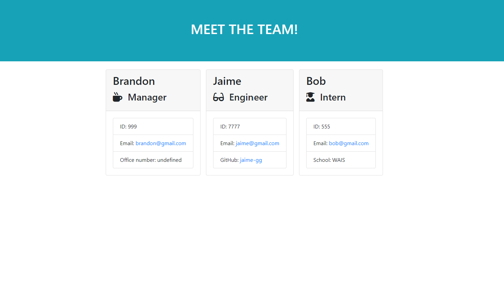

# Team Profile Generator
I was assigned the development of a node application that utilizes INQUIRER to prompt users into developing a webpage that displays cards with the inputed information on the user's team. This team profile generator was created using test driven development that was only made possible through the use of JEST, which ran tests on the files included in the __tests__ folder that is included in this repo.  
 
## Given: User Story
 
```
AS A manager
I WANT to generate a webpage that displays my team's basic info
SO THAT I have quick access to their emails and GitHub profiles
```
 
## Given: Acceptance Criteria
 
```
GIVEN a command-line application that accepts user input
WHEN I am prompted for my team members and their information
THEN an HTML file is generated that displays a nicely formatted team roster based on user input
WHEN I click on an email address in the HTML
THEN my default email program opens and populates the TO field of the email with the address
WHEN I click on the GitHub username
THEN that GitHub profile opens in a new tab
WHEN I start the application
THEN I am prompted to enter the team manager’s name, employee ID, email address, and office number
WHEN I enter the team manager’s name, employee ID, email address, and office number
THEN I am presented with a menu with the option to add an engineer or an intern or to finish building my team
WHEN I select the engineer option
THEN I am prompted to enter the engineer’s name, ID, email, and GitHub username, and I am taken back to the menu
WHEN I select the intern option
THEN I am prompted to enter the intern’s name, ID, email, and school, and I am taken back to the menu
WHEN I decide to finish building my team
THEN I exit the application, and the HTML is generated
```
 
## Usage
To use this application, each user must clone the repo into their local machine. Once done, within the command line insert the 'npm install' command which will download all dependencies. You will then intitialize the application by using the comman 'node index.js'.

Additionally, this application was tested during development through Jest, which can be tested as well through the use of 'npm test' when the Jest module is installed. 

The following video will demo the application, which is followed by a PNG of a webpage sample generated by this project. If for any reason this link is not working, a copy of the video is included in the assets folder for download. 
 
[A walkthrough video for the application](https://drive.google.com/file/d/1AZxW8i7fmMYDRzRa3b_2SU3TZ7vIYpg7/view?usp=sharing)




 
## Review
 
In addition to the following link to the repo, I was made to include a sample INDEX.HTML that was generated using my developed application, this can be found within DIST folder. Just for caution's sake, I'll include the link to it's location in the repo.
 
* GitHub Repo: https://github.com/jaime-gg/team-profile-generator
* Sample Webpage HTML: https://github.com/jaime-gg/team-profile-generator/blob/main/dist/index.html 
 
